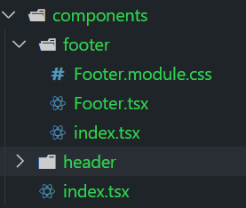

项目配置流程

```
npx create-react-app react-travel --template typescript
cd react-travel
npm install typescript-plugin-css-modules --save-dev  // 不参与最终发布，所以保存在 dev 中
```

在原生项目上的配置文件修改

.vscode  （根目录下）

custom.d.ts （src 目录下）

tsconfig.json （添加配置）


将 App.css rename 为 App.module.css 模块化加载 CSS

将 CSS 引入改成以下类型并修改 className

eg

```JSX
import styles from './App.module.css';


```


#### ant UI 安装 

antd 和 ant-design/icons

```
npm install antd @ant-design/icons
// 导入
import 'antd/dist/antd.css'; // or 'antd/dist/antd.less'
```


#### 文件结构组件化

比如说 文件结构为



那么 footer 和 header 文件夹中 index.tsx 分别导出

```
export * from './Footer'
```

```
export * from './Header'
```

components 文件夹中 index.tsx 导出文件夹

```
export * from './footer'
export * from './header'
```

那么我们在引用 Header 和 Footer 组件时

```
import { Header, Footer } from './components'
```

#### 路由

```
npm install react-router-dom
```

```
// 安装 typescript 类型定义
npm install @types/react-router-dom --save-dev
```

路由配置 5 和 6 有很多区别

https://blog.csdn.net/u010821983/article/details/121283039

```JSX
import { BrowserRouter, Route ,Routes} from "react-router-dom";
import { HomePage } from "./pages";
// <BrowserRouter>  为了路由导航与原生浏览器操作行为一致
function App() {
  return (
    <div>
      <BrowserRouter> 
      <Routes>  
        <Route path= "/" element={ <HomePage/>}></Route>
      </Routes>
      </BrowserRouter>
    </div>
  );
}
```

#### redux

##### 功能 

动态生成语言栏下拉菜单

##### 基本配置

src→redux 文件夹，按照功能模块来划分 action 和 reducer

store.tsx

languageReducer.tsx

Action Creator （工厂模式），避免在 action.type 的 case 中直接输入字符串，以免输错


##### react-redux

安装

```
npm install @types/react-redux --save-dev
// 如果之后报错 Can‘t resolve ‘redux‘ in "paths" 的话
npm install --save redux react-redux
```

在 index.tsx 中引入  Provider 和 store

```
import { Provider } from "react-redux"
import  store  from "./redux/store"
```

在 src → redux 下有 language 文件夹和 hooks.ts 以及 store.ts

1. store.ts 创建 store 并且定义  type RootState，是 store.getState() 的返回值，即动态对应 state.xxx 的类型

2. hooks.ts 重写 react-redux 中的 useSelector 函数。 因为我们在组件中引用 state 时需要知道 state的类型，如果我们直接定义 state 的类型为 RootState 会造成二者耦合，不利于复用。所以我们把 RootState 通过 TypedUseSelectorHook 赋给 useSelector，让 useSelector 里面包含 state 定义

3. language 文件夹包含修改语言的 action 和 reducer

   对于languageActions.ts ：

   1.里面先把我们要传入的 action 名称定义为常量，这样我们在使用的时候不会因为打错了等造成代码出错； 

   2.定义了 action 的接口，比如更改语言的 action

   ```
   interface ChangeLanguageAction {
       type: typeof CHANGE_LANGUAGE,
       payload: "zh" | "en"
   }
   ```

   有的时候，我们可能会写错type payload 或者漏写，所以这样定义以后这样我们外部引用的时候不易出错并且可以联想提示；

   3.用 ActionCreator （工厂模式）把 action 提取出来，我们在使用的时候（dispatch时）直接调用函数，规范 action

   ```
   export const changeLanguageActionCreator = (languageCode: "zh" | "en"): ChangeLanguageAction => {
       return {
           type: CHANGE_LANGUAGE,
           payload: languageCode
       }
   }
   dispatch(addLanguageActionCreator("新语言","new_lang"))
   ```

   对于 languageReducer ，比较简单。定义 LanguageState 类型，初始化一个 state，传入 reducer 中，不同的 action.type 不同的逻辑来更新和 subscribe。其中更改语言，i18n 提供了接口，直接使用即可（会有副作用，不符合纯函数）

- 定义 

react-redux 的一些 hooks

```
// 获得数据  
import { useSelector } from 'react-redux';
// dispatch 
import { useDispatch  } from 'react-redux';
```

##### 国际化 i18n

i18n 

```
npm install react-i18next i18next --save
```

i18n 配置

```
import i18n from "i18next";
import { initReactI18next } from "react-i18next";

import translation_en from "./en.json";
import translation_zh from "./zh.json";

const resources = {
  en: {
    translation: translation_en,
  },
  zh: {
    translation: translation_zh,
  },
};

i18n
  .use(initReactI18next) // passes i18n down to react-i18next
  .init({
    resources,
    lng: "zh",
    // keySeparator: false, // we do not use keys in form messages.welcome
    // header.slogan
    interpolation: {
      escapeValue: false, // react already safes from xss
    },
  });

export default i18n;

```

在主页引入即可

```
import './i18n/configs'
```


#### redux 中间件

redux-thunk 处理 api 请求数据

```
npm install redux-thunk
```

```
import { applyMiddleware } from "redux";
import thunk from "redux-thunk"
```

#### redux-toolkit 

处理封装冗余的模板代码

#### react 处理 html 字符串

`dangerouslySetInnerHTML={{__html: 'html字符串'}}`

#### RTK

在 redux 中的 productDetail 文件夹使用的是 RTK 


#### 单点登录 JWT

jwt 解码插件

```
npm install jwt-decode
```


#### redux-persist 登录持久化

```
npm installredux-persist
```

网站的数据保存有三种方式：Cookie、Session、以及 Web Storage，采用 web storage

优势: 降低网络流量，一旦数据保存在本地以后就可以避免向服务器再次发送请求；快速显示数据；可以被用作临时储存

类型： SessionStorage ：仅在当前浏览器窗口关闭之前有效；localStorage：始终有效，窗口或者浏览器关闭也一直保存

#### 订单页面

paymentForm 插件处理信用卡样式

```
npm install react-credit-c
```

